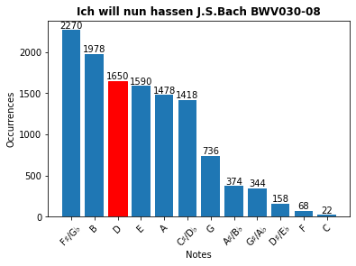

# MIDI Score Analysis

During the 1930s George K. Zipf discovered, that there is a statistical correlation between the frequency a word is used within a document and the its rank within a list counting its occurrence [[1]](https://www.britannica.com/topic/Zipfs-law). Something that applies for manifold languages [[2]](https://arxiv.org/abs/1807.01855).

Put simply, the probability (*p*) of a term occuring in a text is inversely proportional to its rank (*n*) within a frequency list.

**Does Zipf's law apply for music as well?**

This notebook can be used to 

- parse a MIDI file
- map the numeric note values accordingly to their associated note names
- display the notes frequency of occurence (the harmonic complexity will be reduced to the range of a single octave)
- transpose a piece given its initial and target key

of a single MIDI file, to fully answer the question though, a greater analysis over a variety of pieces would be necessary. Although sometimes provided, information about the key the piece was written in is critical for an extensive analysis, due to it would allow for transposing multiple scores, so they could reliably be compared.

The scores used for this demonstration can acquired [here](https://www.classicalarchives.com/), it's free but an account needs to be created.
